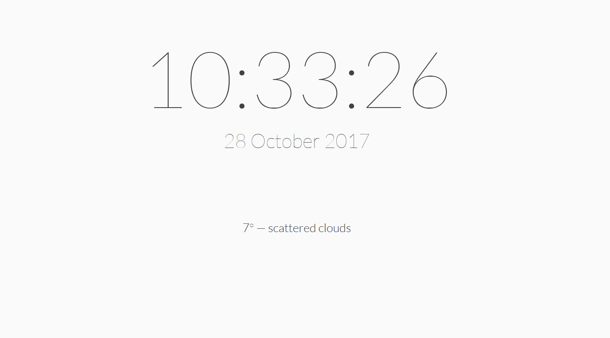
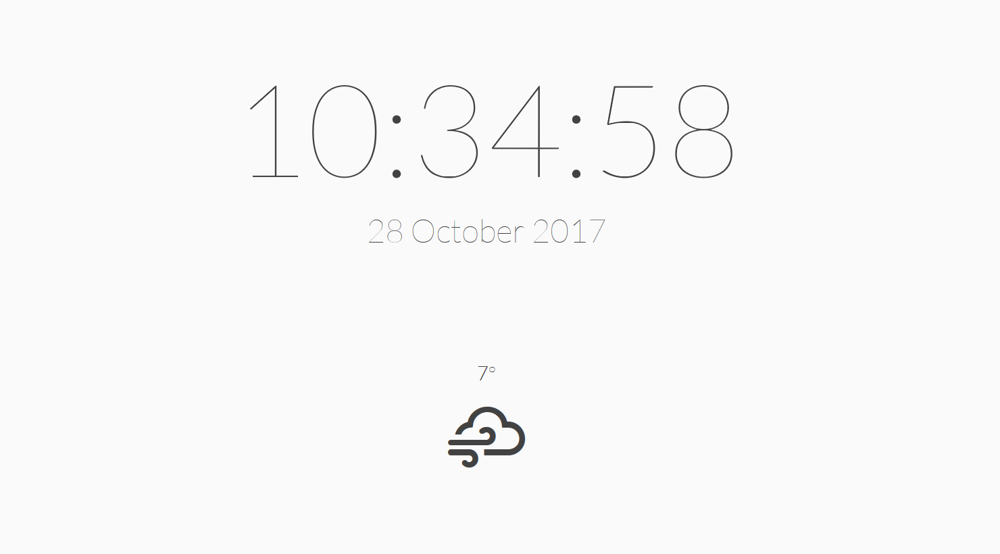
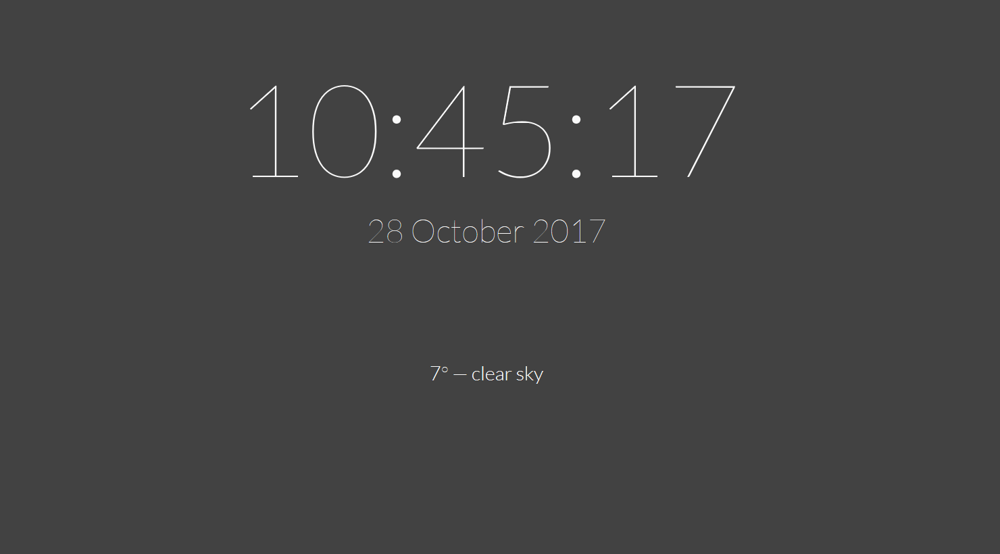
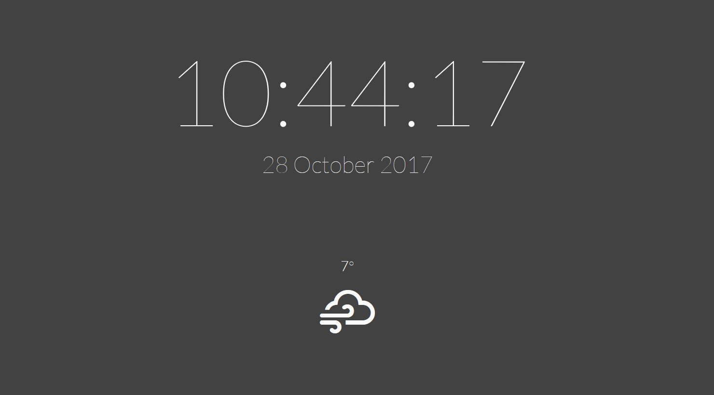
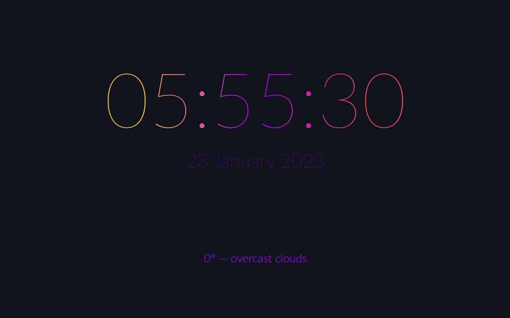

# New tab Moment

Minimalist clock and weather on the new tab page, based on [Moment](https://github.com/alfredxing/moment) from [Alfred Xing](https://alfredxing.com/).

## Screenshots

### Light theme

### Light theme with icon

### Dark theme

### Dark theme with icon

### Custom CSS

### Options page

## Contribute

All contributions are welcome :)

Require `yarn`.

### Install

Clone the repo and run `yarn install`.

## Build

run `yarn build`.

## Test

run `yarn test`.

By default it's Firefox Developer Edition which is used, you can change that in the `web-ext:run` scripts in `package.json`.

If necessary you can create a free account on [OpenWeatherMap](https://openweathermap.org/) and generate two api keys: one for current weather and the second for the geocoding and add them in the `secrets.ts`.

## Credits
Thanks to :
- [Alfred Xing](https://alfredxing.com/) for the original [Moment addon](https://github.com/alfredxing/moment)
- [OpenWeatherMap](https://openweathermap.org/) for the weather data
- [Dennis Tiensvold](https://thenounproject.com/dtiensvold/) for the [clock icon](https://thenounproject.com/term/clock/621519) from [the Noun Project](https://thenounproject.com)
- [Erik Flowers](http://www.helloerik.com/) for the [weather icons](https://erikflowers.github.io/weather-icons/)
