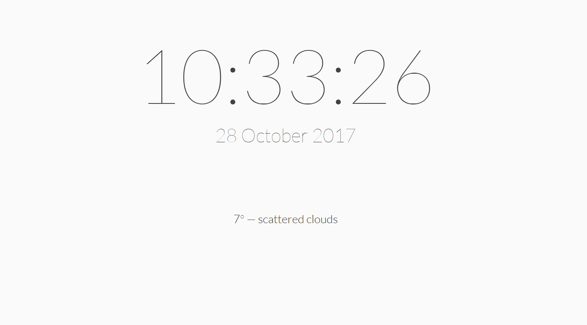
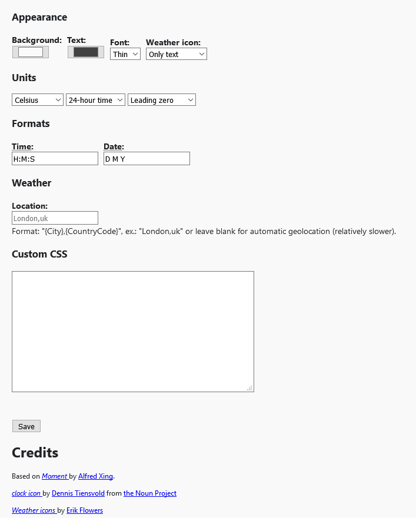
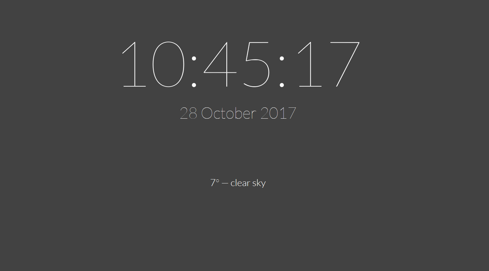
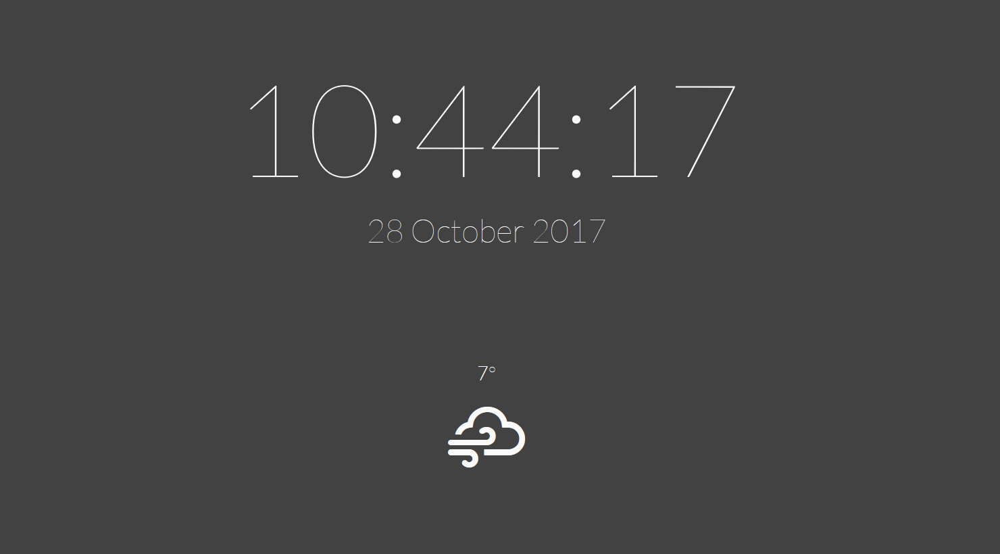

# New tab Moment

Minimalist clock and weather on the new tab page, based on [Moment](https://github.com/alfredxing/moment) from [Alfred Xing](https://alfredxing.com/).

# Screenshots

Default theme:

Default theme with icon:

Options page:

Custom theme:

Custom theme with icon:

## Contribute

All contributions are welcome :)

Require `npm`.

### Install

Clone the repo and run `npm install`.

It will install `typescript` and `web-ext` globally if not already installed, if you prefer to install them locally, modify the `package.json` accordingly.

## Test

run `npm test`.

By default it's Firefox Developer Edition which is used, you can change that in the `web-ext:run` scripts in `package.json`.

## Build

run `npm run build`.